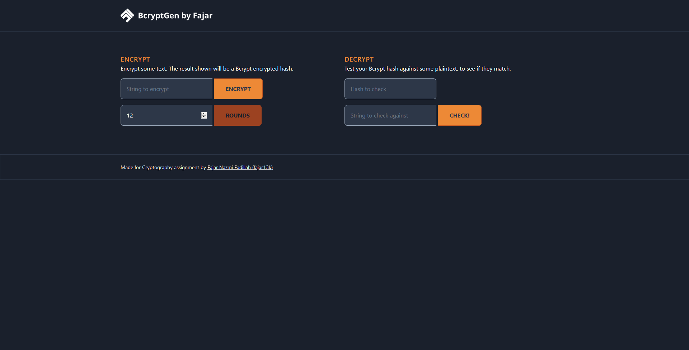

# Project Info

Part of Cryptography lecture's Final Assignment, to analyze any kind of cryptography topics, so i decide to make BCrypt Generator + Checker.

## Preview

## How to install

1. Clone the repository.
2. Do `composer install` to install all depedencies.
3. Make sure to generate the key with `php artisan key:generate`.
4. Run `php artisan serve`.
5. You can access the app with `localhost:8000`.

## What does it do

1. It encrypts your password to any rounds you'd like (min: 4, max: 18 rounds)
2. It checks your hashed password with the decryption feature

## Used

- Visual Studio Code (IDE)
- Laravel
- tailwindcss, purgecss
